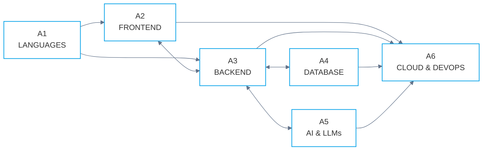

<picture>
  <source media="(prefers-color-scheme: dark)" srcset="assets/header-dark.svg">
  <source media="(prefers-color-scheme: light)" srcset="assets/header-light.svg">
  
</picture>

# Hi, I'm Hakkan Shah

**Full Stack AI Engineer • Next.js • MERN • AI Agents • AI Automations**

Building AI-first applications, desktop agents, automation tools, and scalable web platforms.

<a href="https://hakkan.is-a.dev">Portfolio</a> &nbsp;·&nbsp;
<a href="https://hakkan.persist.org">Persist Portfolio</a> &nbsp;·&nbsp;
<a href="https://github.com/HakkanShah/HakkanShah/raw/main/Hakkan_Parbej_Shah_Resume.pdf">Resume</a> &nbsp;·&nbsp;
<a href="https://linkedin.com/in/Hakkan">LinkedIn</a>

<picture>
  <source media="(prefers-color-scheme: dark)" srcset="assets/rule-dark.svg">
  <source media="(prefers-color-scheme: light)" srcset="assets/rule-light.svg">
  
</picture>

## `01` About Me

I'm a **Full Stack AI Engineer** passionate about building production-grade AI products that combine modern web technologies with LLMs, automation, and intelligent user experiences.

Currently working remotely at [**Persist Ventures**](https://persist.org), where I build and maintain AI-powered products used in production.

### Currently Working On

| REF | In Progress |
|:---|:---|
| `WIP-01` | [**OHM School**](https://ohmschool.org) — AI-powered personalized learning platform featuring adaptive learning, AI tutor (Ollie), mastery tracking, assessments, and intelligent recommendations. |
| `WIP-02` | **Aura Desktop** — AI desktop assistant with voice interaction, desktop automation, browser automation, and multi-provider LLM support. |
| `WIP-03` | Building scalable products using **Next.js, React, TypeScript, Node.js, Supabase, Firebase, and AI APIs.** |
| `WIP-04` | Exploring **AI Agents, MCP, RAG, LLM Workflows, Desktop Automation & System Design.** |
| `WIP-05` | Practicing **Data Structures & Algorithms** to strengthen problem-solving skills. |

<picture>
  <source media="(prefers-color-scheme: dark)" srcset="assets/rule-dark.svg">
  <source media="(prefers-color-scheme: light)" srcset="assets/rule-light.svg">
  
</picture>

## `02` Featured Projects

| REF | Project | Description |
|:---|:---|:---|
| `P-01` | [**OHM School**](https://ohmschool.org) | AI-powered Personalized Learning Platform for adaptive education |
| `P-02` | [**Portfolio**](https://hakkan.is-a.dev) | Interactive terminal-style developer portfolio |
| `P-03` | [**CommitHabit**](https://commithabit.vercel.app) | Automation tool for GitHub contribution streak |

<picture>
  <source media="(prefers-color-scheme: dark)" srcset="assets/rule-dark.svg">
  <source media="(prefers-color-scheme: light)" srcset="assets/rule-light.svg">
  
</picture>

## `03` Tech Stack

**Parts List**

| ITEM | Group | Components |
|:---|:---|:---|
| `A1` | **Languages** | Java · TypeScript · JavaScript · Python · C |
| `A2` | **Frontend** | Next.js · React · Tailwind CSS · HTML · CSS · Shadcn UI |
| `A3` | **Backend** | Node.js · Express · REST API |
| `A4` | **Database** | MongoDB · PostgreSQL · MySQL · Redis · Firebase · Supabase |
| `A5` | **AI & LLMs** | OpenAI · Google Gemini · Anthropic Claude · Groq · NVIDIA NIM |
| `A6` | **Cloud & DevOps** | Git · GitHub · Docker · Vercel · Netlify · Render |

<picture>
  <source media="(prefers-color-scheme: dark)" srcset="assets/rule-dark.svg">
  <source media="(prefers-color-scheme: light)" srcset="assets/rule-light.svg">
  
</picture>

## `04` GitHub Activity

<picture>
  <source media="(prefers-color-scheme: dark)" srcset="https://github-readme-stats.vercel.app/api?username=HakkanShah&show_icons=true&bg_color=060D14&title_color=38BDF8&icon_color=38BDF8&text_color=9CC2D8&border_color=2A5A7D&border_radius=0">
  <source media="(prefers-color-scheme: light)" srcset="https://github-readme-stats.vercel.app/api?username=HakkanShah&show_icons=true&bg_color=F1F6FA&title_color=0B6FA4&icon_color=0B6FA4&text_color=2C4A5E&border_color=8FB0C7&border_radius=0">
  
</picture>

<picture>
  <source media="(prefers-color-scheme: dark)" srcset="https://streak-stats.demolab.com?user=HakkanShah&background=060D14&border=2A5A7D&stroke=2A5A7D&ring=38BDF8&fire=38BDF8&currStreakNum=DCEBF7&sideNums=DCEBF7&currStreakLabel=38BDF8&sideLabels=9CC2D8&dates=5B87A3&border_radius=0">
  <source media="(prefers-color-scheme: light)" srcset="https://streak-stats.demolab.com?user=HakkanShah&background=F1F6FA&border=8FB0C7&stroke=8FB0C7&ring=0B6FA4&fire=0B6FA4&currStreakNum=0C2436&sideNums=0C2436&currStreakLabel=0B6FA4&sideLabels=2C4A5E&dates=5A7C93&border_radius=0">
  
</picture>

  

<picture>
  <source media="(prefers-color-scheme: dark)" srcset="https://github-readme-activity-graph.vercel.app/graph?username=HakkanShah&bg_color=060D14&color=9CC2D8&title_color=38BDF8&line=38BDF8&point=DCEBF7&area=true&area_color=38BDF8&hide_border=true">
  <source media="(prefers-color-scheme: light)" srcset="https://github-readme-activity-graph.vercel.app/graph?username=HakkanShah&bg_color=F1F6FA&color=2C4A5E&title_color=0B6FA4&line=0B6FA4&point=0C2436&area=true&area_color=0B6FA4&hide_border=true">
  
</picture>

  

<picture>
  <source media="(prefers-color-scheme: dark)" srcset="https://github-readme-stats.vercel.app/api/top-langs/?username=HakkanShah&layout=compact&bg_color=060D14&title_color=38BDF8&text_color=9CC2D8&border_color=2A5A7D&border_radius=0">
  <source media="(prefers-color-scheme: light)" srcset="https://github-readme-stats.vercel.app/api/top-langs/?username=HakkanShah&layout=compact&bg_color=F1F6FA&title_color=0B6FA4&text_color=2C4A5E&border_color=8FB0C7&border_radius=0">
  
</picture>

<picture>
  <source media="(prefers-color-scheme: dark)" srcset="assets/rule-dark.svg">
  <source media="(prefers-color-scheme: light)" srcset="assets/rule-light.svg">
  
</picture>

## `05` What I Enjoy Building

| | | |
|:---|:---|:---|
| ◆ &nbsp;AI Agents & Autonomous Workflows | ◆ &nbsp;Desktop Applications (Electron) | ◆ &nbsp;Full Stack Web Applications |
| ◆ &nbsp;AI-powered Education Platforms | ◆ &nbsp;Developer Productivity Tools | ◆ &nbsp;Voice Interfaces |
| ◆ &nbsp;RAG & Knowledge Systems | ◆ &nbsp;Premium UI/UX Experiences | ◆ &nbsp;Performance Optimization |

<picture>
  <source media="(prefers-color-scheme: dark)" srcset="assets/rule-dark.svg">
  <source media="(prefers-color-scheme: light)" srcset="assets/rule-light.svg">
  
</picture>

## `06` Let's Connect

| CHANNEL | ADDRESS |
|:---|:---|
| `NET-01` | [Portfolio](https://hakkan.is-a.dev) — hakkan.is-a.dev |
| `NET-02` | [Persist Portfolio](https://hakkan.persist.org) — hakkan.persist.org |
| `NET-03` | [Email](mailto:hakkanparbej@gmail.com) — hakkanparbej@gmail.com |
| `NET-04` | [LinkedIn](https://linkedin.com/in/Hakkan) — linkedin.com/in/Hakkan |
| `NET-05` | [GitHub](https://github.com/HakkanShah) — github.com/HakkanShah |

<picture>
  <source media="(prefers-color-scheme: dark)" srcset="assets/rule-dark.svg">
  <source media="(prefers-color-scheme: light)" srcset="assets/rule-light.svg">
  
</picture>

| DRAWN BY | SHEET | REVISION | STATUS |
|:---:|:---:|:---:|:---:|
| Hakkan Parbej Shah | 01 of 01 | 2.0 | Active |

  

*"Code. Build. Learn. Ship. Repeat."*

