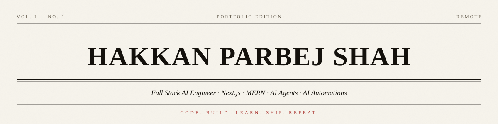
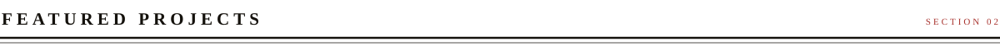
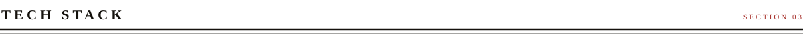

<picture>
  <source media="(prefers-color-scheme: dark)" srcset="assets/news/masthead-dark.svg">
  <source media="(prefers-color-scheme: light)" srcset="assets/news/masthead-light.svg">
  
</picture>

### Hi, I'm Hakkan Shah

**Full Stack AI Engineer • Next.js • MERN • AI Agents • AI Automations**

Building AI-first applications, desktop agents, automation tools, and scalable web platforms.

<a href="https://hakkan.is-a.dev">Portfolio</a> &nbsp;·&nbsp;
<a href="https://hakkan.persist.org">Persist Portfolio</a> &nbsp;·&nbsp;
<a href="https://github.com/HakkanShah/HakkanShah/raw/main/Hakkan_Parbej_Shah_Resume.pdf">Resume</a> &nbsp;·&nbsp;
<a href="https://linkedin.com/in/Hakkan">LinkedIn</a>

<picture>
  <source media="(prefers-color-scheme: dark)" srcset="assets/news/h-about-dark.svg">
  <source media="(prefers-color-scheme: light)" srcset="assets/news/h-about-light.svg">
  
</picture>

> I'm a **Full Stack AI Engineer** passionate about building production-grade AI products that combine modern web technologies with LLMs, automation, and intelligent user experiences.

Currently working remotely at [**Persist Ventures**](https://persist.org), where I build and maintain AI-powered products used in production.

#### Currently Working On

- [**OHM School**](https://ohmschool.org) — AI-powered personalized learning platform featuring adaptive learning, AI tutor (Ollie), mastery tracking, assessments, and intelligent recommendations.
- **Aura Desktop** — AI desktop assistant with voice interaction, desktop automation, browser automation, and multi-provider LLM support.
- Building scalable products using **Next.js, React, TypeScript, Node.js, Supabase, Firebase, and AI APIs.**
- Exploring **AI Agents, MCP, RAG, LLM Workflows, Desktop Automation & System Design.**
- Practicing **Data Structures & Algorithms** to strengthen problem-solving skills.

<picture>
  <source media="(prefers-color-scheme: dark)" srcset="assets/news/h-projects-dark.svg">
  <source media="(prefers-color-scheme: light)" srcset="assets/news/h-projects-light.svg">
  
</picture>

| Project | Description |
|:---|:---|
| [**OHM School**](https://ohmschool.org) | AI-powered Personalized Learning Platform for adaptive education |
| [**Portfolio**](https://hakkan.is-a.dev) | Interactive terminal-style developer portfolio |
| [**CommitHabit**](https://commithabit.vercel.app) | Automation tool for GitHub contribution streak |

<picture>
  <source media="(prefers-color-scheme: dark)" srcset="assets/news/h-stack-dark.svg">
  <source media="(prefers-color-scheme: light)" srcset="assets/news/h-stack-light.svg">
  
</picture>

| | |
|:---|:---|
| **Languages** | Java · TypeScript · JavaScript · Python · C |
| **Frontend** | Next.js · React · Tailwind CSS · HTML · CSS · Shadcn UI |
| **Backend** | Node.js · Express · REST API |
| **Database** | MongoDB · PostgreSQL · MySQL · Redis · Firebase · Supabase |
| **AI & LLMs** | OpenAI · Google Gemini · Anthropic Claude · Groq · NVIDIA NIM |
| **Cloud & DevOps** | Git · GitHub · Docker · Vercel · Netlify · Render |

<picture>
  <source media="(prefers-color-scheme: dark)" srcset="assets/news/h-activity-dark.svg">
  <source media="(prefers-color-scheme: light)" srcset="assets/news/h-activity-light.svg">
  
</picture>

<picture>
  <source media="(prefers-color-scheme: dark)" srcset="https://streak-stats.demolab.com?user=HakkanShah&background=12100B&border=EDE7DA&stroke=EDE7DA&ring=C9564B&fire=C9564B&currStreakNum=EDE7DA&sideNums=EDE7DA&currStreakLabel=C9564B&sideLabels=9A917F&dates=9A917F&border_radius=0">
  <source media="(prefers-color-scheme: light)" srcset="https://streak-stats.demolab.com?user=HakkanShah&background=F7F4EC&border=14110C&stroke=14110C&ring=A8322D&fire=A8322D&currStreakNum=14110C&sideNums=14110C&currStreakLabel=A8322D&sideLabels=6B6355&dates=6B6355&border_radius=0">
  
</picture>

<picture>
  <source media="(prefers-color-scheme: dark)" srcset="assets/news/h-building-dark.svg">
  <source media="(prefers-color-scheme: light)" srcset="assets/news/h-building-light.svg">
  
</picture>

- AI Agents & Autonomous Workflows
- Desktop Applications (Electron)
- Full Stack Web Applications
- AI-powered Education Platforms
- Developer Productivity Tools
- Voice Interfaces
- RAG & Knowledge Systems
- Premium UI/UX Experiences
- Performance Optimization

<picture>
  <source media="(prefers-color-scheme: dark)" srcset="assets/news/h-connect-dark.svg">
  <source media="(prefers-color-scheme: light)" srcset="assets/news/h-connect-light.svg">
  
</picture>

- [Portfolio](https://hakkan.is-a.dev) — hakkan.is-a.dev
- [Persist Portfolio](https://hakkan.persist.org) — hakkan.persist.org
- [Email](mailto:hakkanparbej@gmail.com) — hakkanparbej@gmail.com
- [LinkedIn](https://linkedin.com/in/Hakkan) — linkedin.com/in/Hakkan
- [GitHub](https://github.com/HakkanShah) — github.com/HakkanShah

<picture>
  <source media="(prefers-color-scheme: dark)" srcset="assets/news/rule-dark.svg">
  <source media="(prefers-color-scheme: light)" srcset="assets/news/rule-light.svg">
  
</picture>

  

*"Code. Build. Learn. Ship. Repeat."*

